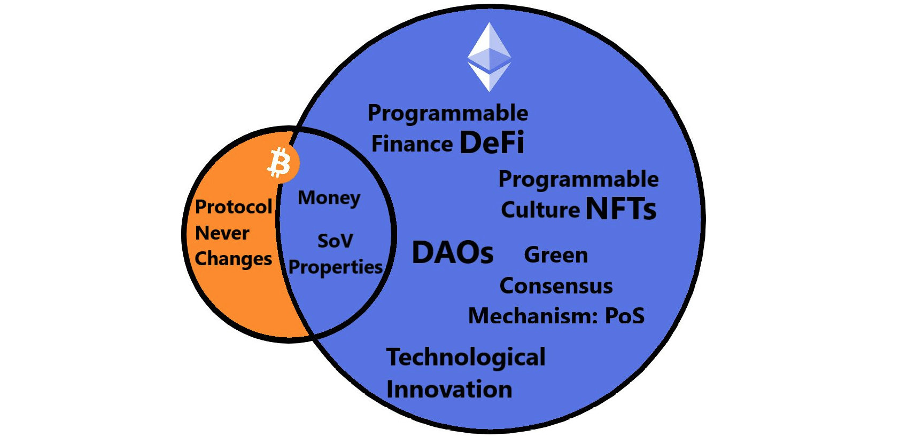

# Kdo jsme?

**Gwei.cz je Česko/Slovenská komunita příznivců platformy [Ethereum](klicove-pojmy.md#ethereum) a hnutí okolo [decentralizovaných financí](klicove-pojmy.md#decentralizované-finance-defi) (DeFi), [internetu nové generace](./klicove-pojmy.md#web3) (Web3), [decentralizovaných organizacích](./klicove-pojmy.md#decentralizované-organizace-dao) (DAO) a obecně decentralizovaných a svobodných technologií ([FOSS](/komunita/klicove-pojmy#free-and-open-source-software-foss)). Nezajímá nás spekulace na ceně, ale reálný technologický pokrok, který postupně mění nejenom svět tradičních financí.**

### ✨ Naše hodnoty

* Otevřenost
* Decentralizace
* Neutralita
* Odolnost vůči cenzuře
* Veřejný zájem
* Transparentnost

### :tada: Naše cíle

* Šíření osvěty o Ethereu, DeFi a dalších otevřených kryptoměnách
* Tvorba [komunikačního a informačního prostoru](/komunita/komunikacni-kanaly) pro všechny příznivce stejných hodnot
* Pořádání různých pravidelných [online či offline událostí](/udalosti)
* Tvorba nebo podpora nově vznikajících [edukačních projektů](/projekty) a provozování [užitečných služeb](/projekty)

### :handshake: Přidejte se k nám

Ke komunitě se může přidat každý, a to hned na několika [komunikačních kanálech](komunikacni-kanaly/):

* Na [Fóru](/komunita/komunikacni-kanaly/forum), kde řešíme spíše komunitní věci (projekty, akce, atd.)
* Na nášem [Matrix](/komunita/komunikacni-kanaly/matrix) chatu, kde se bavíme o novinkách či pomáháme nováčkům
* Můžete nás sledovat i na [Twitteru](/komunita/komunikacni-kanaly/twitter), kde informujeme o novinkách

Pokud se chcete zapojit více aktivněji, můžete nám pomoci s organizací [našich událostí](/udalosti), nebo pomoci s rozvojem komunitních [projektů a služeb](/projekty) - případně nás [podpořit finančně](podporte-nas/financni-podpora).

Každá komunita musí být alespoň v omezené míře spravována - u nás k tomu slouží [Council](council), který je aktuálně složený z 16-ti ethereum pozitivních lidí.

:::tip Co to znamená "gwei"?
`Gwei` znamená "giga-wei", tedy milion "wei". `Wei` je [nejmenší monetární jednotka Etheru](https://ethereum.org/en/developers/docs/intro-to-ether/#denominations) (ETH). Je pojmenovaná po čínském kryptografovi [Wei Dai](https://en.wikipedia.org/wiki/Wei_Dai), který přispěl zásadní měrou ke vzniku kryptoměn.
:::
