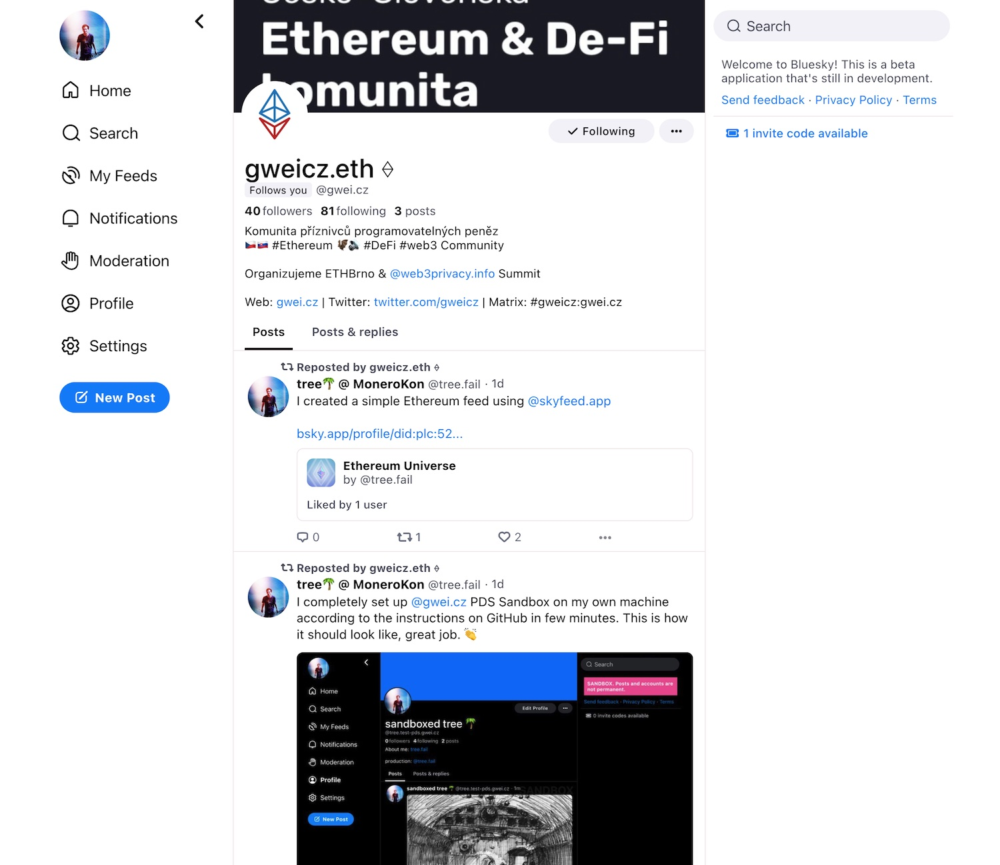

# Bluesky (AT Protocol)

* Účet: [**`@gwei.cz`**](https://bsky.app/profile/gwei.cz)
* Spravuje:
  * [@tree](https://forum.gwei.cz/u/tree) (bluesky: [`@tree.fail`](https://bsky.app/profile/tree.fail))

[Bluesky](https://blueskyweb.xyz/), resp. [AT Protocol](https://atproto.com/) je nový protokol a sociální síť, sloužící jako otevřená a decentralizovaná náhrada [Twitteru](/komunikacni-kanaly/twitter).

```mdx-code-block
import Button from '@site/src/components/Button';

<Button href="https://bsky.app/profile/gwei.cz" text="Sledujte @gwei.cz na Bluesky" />
```
<br/><br/>


:::info Zatím jen na pozvánky
Bluesky/AT Protokol je v současné době (červen 2023) v early-adopter fázi a registrace jsou jen na pozvánky. O pozvánku si můžete zažádat v našem [Bluesky CZ/SK kanále](https://forum.gwei.cz/t/cesko-slovensky-kanal-pro-uzivatele-bluesky-at-protocol/624) na Matrixu.
:::

## Screenshot

[](https://bsky.app/profile/gwei.cz)
