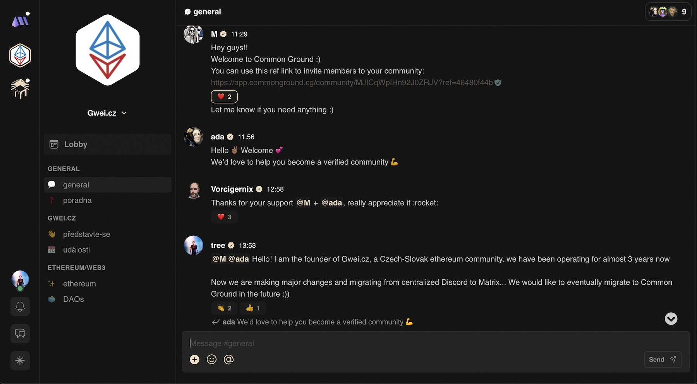

# Common Ground (nepoužívané)

* Adresa: [**`cg.gwei.cz`**](https://cg.gwei.cz/) (obsahuje pozvánku)
* Spravuje: [@tree](https://forum.gwei.cz/u/tree)

[Common Ground](https://commonground.cg/) je Web3 chatovací platforma, která se snaží vytvořit místo pro komunity jako například DAO, kde spolu mohou komunikovat a spolupracovat. Jde o službu podobnou Discordu.

:::caution Ve vývoji
Common Ground projekt je na začátku svého vývoje, zatím jde spíše o testovací verzi.
:::

## Náhled

